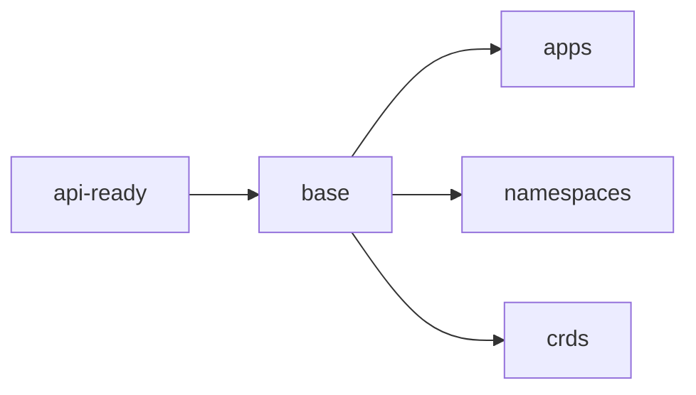

# Bootstrap

Everything needed to take a freshly provisioned Talos cluster (via Omni/Terraform)
to a state where Flux manages the rest of the repository. Run:

```sh
just bootstrap cluster
```

Once it completes, Flux reconciles `kubernetes/` and this directory is not used
again until the next rebuild.

## Prerequisites

- Tools on PATH: `kubectl`, `helmfile`, `kustomize`, `just`, `minijinja-cli`, `op`, `yq`, `gum`
- Signed-in 1Password CLI (`op`) with access to the `cloud-ops` vault
- Valid kubeconfig for the cluster (from Omni or `talosctl kubeconfig`)
- Cluster provisioned via `infrastructure/terraform` (Hetzner + Omni)

Unlike [onedr0p/home-ops](https://github.com/onedr0p/home-ops), this repo does
not bootstrap Talos nodes or etcd from here — Omni/Terraform owns cluster
lifecycle.

## Stages

`just bootstrap cluster` runs these stages in order (see [mod.just](mod.just)):



1. **api-ready** — Wait until the Kubernetes API answers `/readyz`.
2. **base** — Wait for nodes to register, apply namespaces from `kubernetes/apps`,
   render bootstrap Secrets through `op inject` (`kustomize/cloud-ops/`), then
   apply CRDs from `helmfile/crds.yaml` (extract only, not helm sync).
3. **apps** — `helmfile sync` of `helmfile/apps.yaml`, the minimal chain Flux
   needs before GitOps takes over:

   `cilium → talos-ccm → cert-manager → external-secrets → onepassword-connect → flux-operator → flux-instance`

Every stage is safe to re-run. If bootstrap fails partway, fix the issue and run
`just bootstrap cluster` again.

## Single source of truth

Helmfile defines no chart versions or values of its own. Each release reads its
chart and tag from the app's `ocirepository.yaml` (or `helmrelease.yaml` for
Hetzner charts) and values from `helmrelease.yaml` under `kubernetes/apps/` (see
[helmfile/templates/](helmfile/templates/)). Bootstrap installs exactly what Flux
will later reconcile; Renovate only updates one place.

## Cloud-specific notes

- Bootstrap Secrets include Hetzner tokens for CCM/CSI before Flux installs those
  charts.
- `onepassword-connect` postsync hooks wait for ESO webhooks and apply the
  `ClusterSecretStore`.
- ESO HelmRelease sets `installCRDs: false` and `install/upgrade.crds: Skip` so
  Flux does not delete CRDs applied in the **base** stage.
